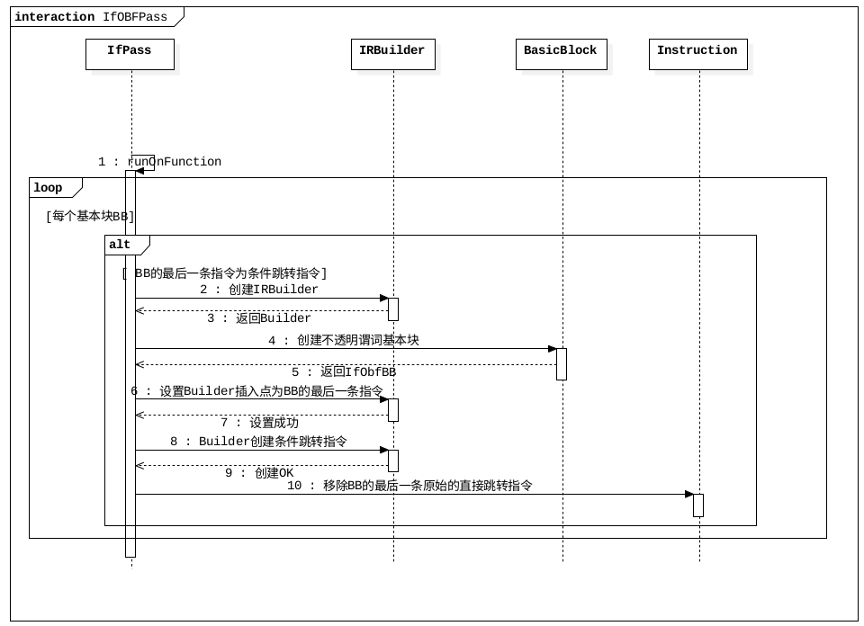
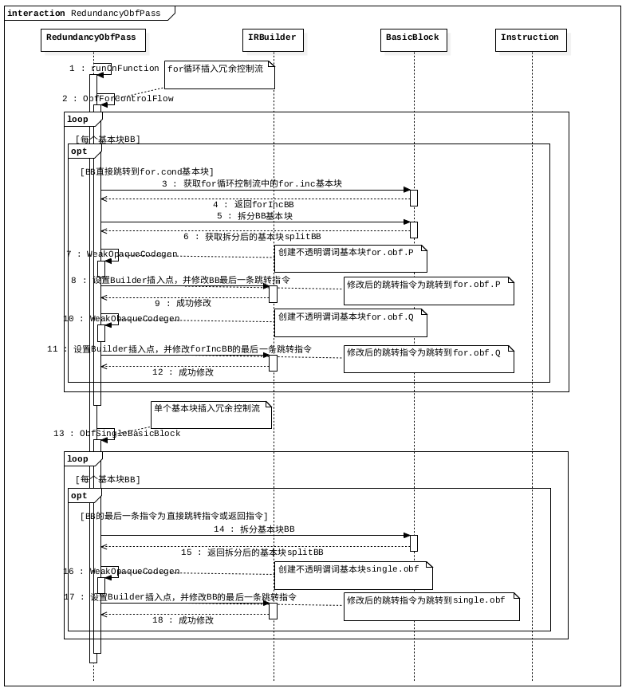
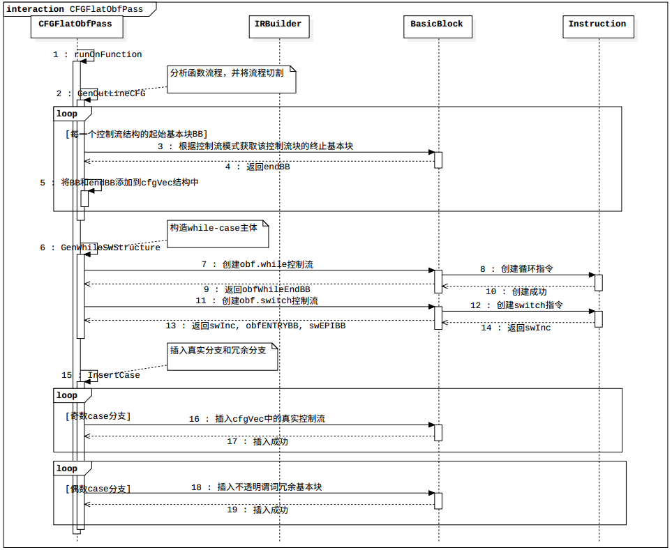
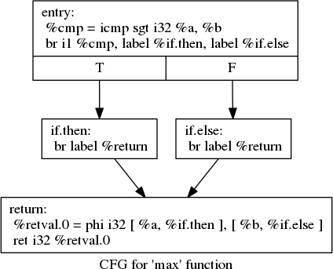
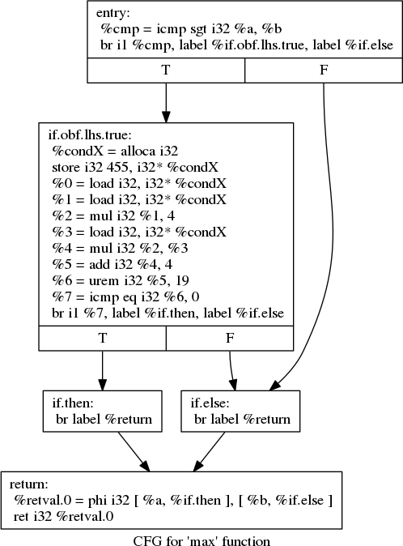
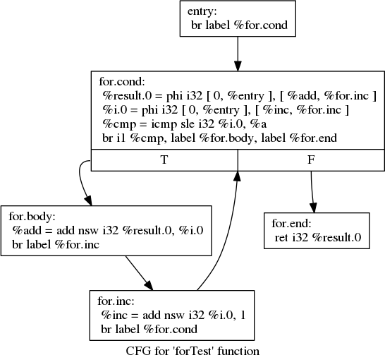

# Obfuscation

添加llvm pass实现代码混淆
- 方案一：扩展判断条件
- 方案二：插入冗余控制流
- 方案三：控制流平展化

详细实现请阅读







# 扩展判断条件
一个简单max函数的llvm ir展示：
```c
int max(int a, int b)
{
    if (a > b)
        return a;
    else 
        return b;
}
```
生成的llvm ir的控制流图：



在LLVM IR中，实现条件“与”操作，并不是通过特定的指令，而是通过添加判断控制流实现的。例如，当我们在上面的控制流中添加一个`数论不透明谓词`判断表达式时，生成的`LLVM IR`控制流如下图所示。


实现方案：依次遍历每个函数的所有基本块BB，以基本块为单位做以下处理：
1. 判断当前BB的最后一条指令是否为条件跳转指令，如果是，执行下一步；不是，直接执行下一次循环。
2. 创建我们的不透明谓词PT基本块`ObfBB`，`ObfBB`为`True`时跳转到BB为`True`时的基本块；`ObfBB`为`False`时跳转到`函数最后一个基本块`。
3. 将BB的最后一条条件跳转指令为True时要跳转的基本块改变为跳转到`ObfBB`。

# 插入冗余控制流
在LLVM中，所有的控制流都是由基本块组成的，所以我们在插入冗余控制流时也是基于基本块来做操作。

接下来，我们会依次讨论针对`顺序基本块`和`循环控制流`,我们要如何设计方案来插入冗余控制流。当然，本质上上一节的内容也是属于插入冗余控制流，不过体现在高级语言上，它更类似于扩展判断条件，所以独立列为一节。

## For循环
以一个`求累积和`的算法为例：
```c
int forTest(int a){
    int result=0;
    for(int i=0;i <= a;i++)
        result += i;
    return result;
}
```
可以看到，一个for循环可以由四个部分组成
- 初始化语句：int i=0;
- 循环判断条件：i<=a;
- 循环体：result+=i;
- 循环迭代表达式：i++;

事实上，在由Clang对for循环结构生成的`LLVM IR`也是包含这四个部分。


为了方便我们分析，我们首先将该图化为不可归约的。
然后插入我们的冗余控制流的。仍然采取插入不透明谓词的方式。

## 实现方案

### 1.针对单个基本块

根据对单个基本块混淆方案的设计可以了解到：

- 我们首先会将基本块进行分裂，所以基本块指令所包含的指令数目`必须大于2条`。

- 我们会构造不透明谓词插入到原始控制流中。并且为了该方案不与其他方案冲突，且保证该方案实现的正确性。我们只对两种基本块做处理：
    - 基本块的最后一条指令为`直接跳转指令`。
    - 基本块的最后一条指令为`返回指令`。

实现方案：依次遍历每个函数的所有基本块BB，以基本块为单位做以下处理。
1. 判断该基本块的最后一条指令是否符合要求（为直接跳转指令或返回指令）。是，则进行下一步操作；否，则直接循环continue处理下一个BB。
2. 根据所包含指令的数目从中间拆分BB，拆分后的基本块命名为`single.split.BB`。
3. **创建不透明谓词基本块**，命名为`single.obf`。
4. 更改BB的**最后一条跳转指令**，跳转到`single.obf`基本块。

### 2. 针对循环基本块
根据从`for循环基本块`的处理方案可以了解到核心内容为:
- 找到循环条件基本块`for.BB`，然后找到循环条件基本块的两个前基本块：`BB（循环控制流的前基本块）`和`for.inc.BB（循环迭代基本块）`。
- 创建`两个不透明谓词基本块`，根据设计方案插入到循环控制流中。

实现方案：依次遍历每个函数的所有基本块BB，以基本块为单位做以下处理。
1. 判断当前基本块BB的直接跳转基本块是否为`for.cond`。若是，执行下一步；不是，直接中止本轮循环，执行下一次循环。
2. 找到循环结构的`for.inc`基本块。
3. 分裂BB，分裂后的基本块命名为`for.cond.pre.split.BB`。
4. 创建不透明谓词基本块，命名为`for.obf.P`。
5. 更改`for.cond.pre.split.BB`的最后一条跳转指令为跳转到for.obf.BB基本块。
6. 创建不透明谓词基本块，命名为`for.obf.Q`。
7. 更改`for.inc`基本块的最后一条指令，改变为跳转到`for.obf.Q`基本块。

我们在具体实现该Pass时，分别将**对基本块进行处理**和**for循环处理**分为两个函数。
# 控制流平展化

我们可以将控制流转换为如下的通用结构：
```c
while()
{
    switch()
    {

    }
}
```
设计方案：我们可以设置**循环条件为1**，即循环一直执行。然后通过switch的派遣变量`swVar`来决定要执行哪一个分支。当然了，我们会插入很多不执行的无用分支，用来提高代码的安全性。
在设计我们的方案时，有下面几个点需要我们思考：
- 由于switch结构中有很多分支，原始控制流的分支会被执行，而人工构造的冗余控制流不会执行。那么应该如何拆分原始控制流分散在多个case分支中？
- 为了保证控制流平坦化后原始程序控制流的运行顺序不改变，我们应该如何确定派遣变量swVar的值？

针对这两个问题，本项目采取的方案是：
1. 为了保证平坦化后核心执行流程不至于太多，来很大程序上影响到程序的执行效率。所以决定根据控制流类型分为`直流控制流`、`if判断控制流`、`for循环控制流`、`while循环控制流`、`do-while循环控制流`和`switch分支控制流`。每个case分支都只执行上述6个控制流中的一个。
2. 为了使设计尽可能的简单。我们决定在**swVar为奇数时**，执行真实控制流；swVar的取值依次是1,3,5,7....

实现方案：
1. 将被处理函数的最外层全部控制流根据前面的设计方案分为6类（直流控制流、if判断控制流、for循环控制流、while循环控制流、do-while控制流、switch-case控制流），记录在向量`BBVec`中（并标记每个控制流的起始基本块和结束基本块）。
2. 使用LLVMIR`构造最外层while循环控制流`和`主控制switch-case分支`，并**设置派遣变量swVar**。
3. 按照顺序将向量BBVec中保存的真实控制流`插入到主switch-case的奇数分支中`。
4. 在主switch-case的`偶数分支插入不透明谓词基本块`。

# 参考资料
- 【作者blog】https://l0phtg.top/tags/llvm/
- 【CMU15745课程，推荐看看他们的ppt】https://www.cs.cmu.edu/~15745/